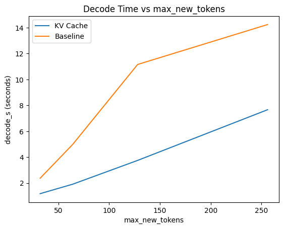

# Week 02 — KV Cache & Incremental Decode

## 1. Objective

Replace full-context recomputation during decoding with a KV-cache–based incremental decode, while preserving correctness and API behavior.

---

## 2. Implementation Changes

### KV Cache

* Enabled `use_cache=True`
* Store and reuse `past_key_values` across decode steps

### Incremental Decode

* After prefill, each decode step feeds **only the newly generated token**
* Attention mask extended by one position per step
* Eliminates full-context re-forwarding

---

## 3. Why This Improves Performance

Baseline decoding recomputes attention over the full sequence on every step.

If the sequence length is `n`, this leads to approximately:

* **O(n²)** compute over the full decode process.

With KV cache:

* Prefill runs once.
* Each decode step processes only the new token.
* Cached keys/values prevent recomputation.

Resulting behavior:

* **Approximate O(n)** decode scaling.

---

## 4. Benchmark Setup

* Model: `distilgpt2`
* Device: CPU
* Metric: `decode_s`
* Values shown are **medians of 3 runs**
* Tokens swept: 32, 64, 128, 256

---

## 5. Results

### 5.1 Decode Time (seconds)

| max_new_tokens | KV Cache | Baseline | Speedup |
| -------------- | -------- | -------- | ------- |
| 32             | 1.176    | 2.369    | 2.01×   |
| 64             | 1.905    | 4.975    | 2.61×   |
| 128            | 3.744    | 11.153   | 2.98×   |
| 256            | 7.659    | 14.236   | 1.86×   |

Speedup computed as:

```
baseline_decode_s / kv_decode_s
```

Peak improvement observed at 128 tokens (~3×).

---

### 5.2 Decode Time Scaling



The baseline curve bends upward as token count increases, while KV decode grows more smoothly.

---

### 5.3 Throughput Scaling


KV cache maintains relatively stable throughput as output length grows, while baseline throughput degrades.

---

## 6. Interpretation

* Baseline decode time increases significantly with output length due to repeated full-context attention.
* KV cache eliminates redundant computation.
* Throughput remains stable (~24–25 tokens/sec) under KV.
* Improvement increases with sequence length.

Minor variance at 256 tokens is attributed to CPU scheduling noise.

---

## 7. Correctness Validation

A deterministic toy-model regression test verifies:

* KV decode produces identical token sequences to the baseline full-context decode under greedy sampling.
* Output tensor equality is asserted directly.

This confirms functional equivalence between implementations.

---

## 8. Remaining Limitations

* No batching
* No streaming token output
* Single-request execution
* CPU-only benchmarking
